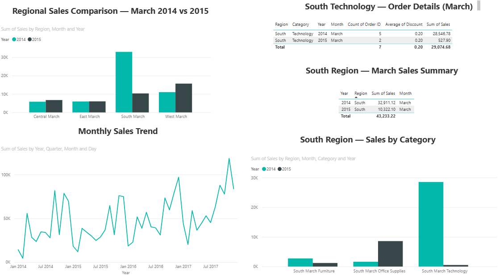

# 📉 Sales Decline Root-Cause Analysis

A one-page Power BI dashboard that investigates a scary-looking 69% sales drop — and finds out if it's a real problem or a false alarm.

---

## ❓ The Problem

Total company sales in **March 2015 dropped 69%** compared to March 2014 ($32.9K → $10.3K) — the biggest single-month drop in the entire 4-year dataset. On paper, that looks like a major business crisis.

## 🔍 What I Did

Instead of trusting the scary number, I drilled down step by step to find where the drop was actually coming from:

1. **Checked all regions** → Central, East, and West were fine. Only **South** had dropped.
2. **Checked categories within South** → Furniture and Office Supplies were fine. Only **Technology** had collapsed (-98%).
3. **Checked order count and discounts** → Discount rate didn't change (20% both years). Order count barely changed (5 orders → 2 orders).

## ✅ What I Found

The 2014 number was inflated by just **a few large one-off orders** that simply didn't happen again in 2015. It wasn't fewer customers, a pricing change, or a real slowdown — it was a **small sample size problem**, not a business problem.

**Bottom line:** No action needed on the 2015 numbers. But since South Technology revenue depends on a handful of big orders, that segment is worth watching going forward.

---

## 🖼️ Dashboard

- **Regional Sales Comparison** — shows only South dropped
- **South Region — Sales by Category** — shows only Technology dropped
- **South Technology — Order Details** — shows order count/discount barely moved
- **Monthly Sales Trend** — shows the business grew steadily overall
- **South Region — March Sales Summary** — the raw before/after numbers

---

## 🛠️ Tools Used

Power BI Desktop · Power Query · DAX · [Superstore Dataset](https://www.kaggle.com/datasets/vivek468/superstore-dataset-final) (Kaggle)

---

## 🚀 How to View

1. Download PowerBI FIle  [*Power_BI*](powerbi.pbix)
2. Open in [Power BI Desktop (free)](https://www.microsoft.com/en-us/power-platform/products/power-bi/downloads)

No Power BI? Just check the screenshot above.

---

## 🙌 Contact

📩 [sushrutworks@gmail.com](mailto:sushrutworks@gmail.com)
🔗 [LinkedIn](https://www.linkedin.com/in/sushrutt/)
💻 [Portfolio](https://sushrut-portfolio.netlify.app/)
